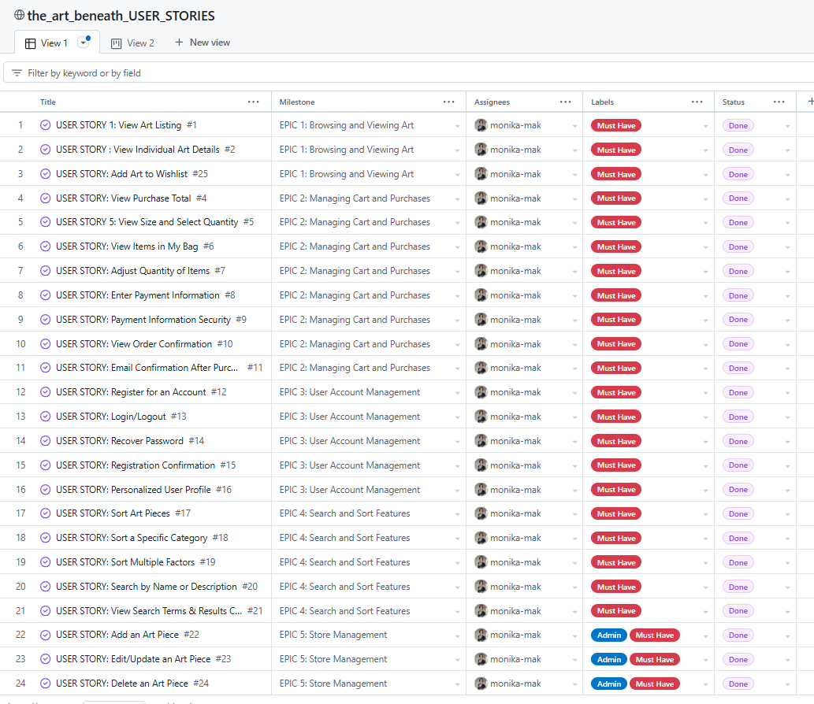
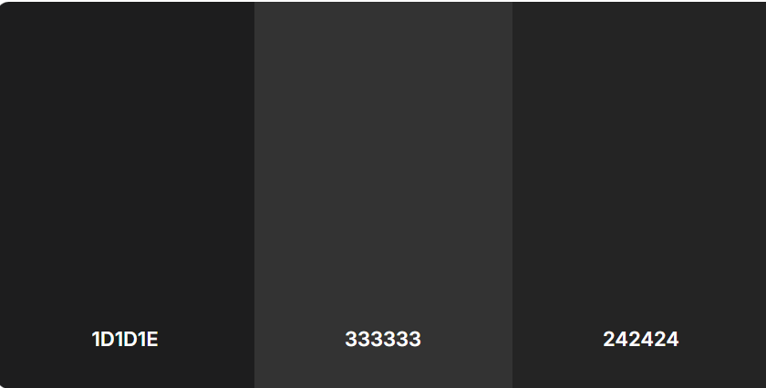
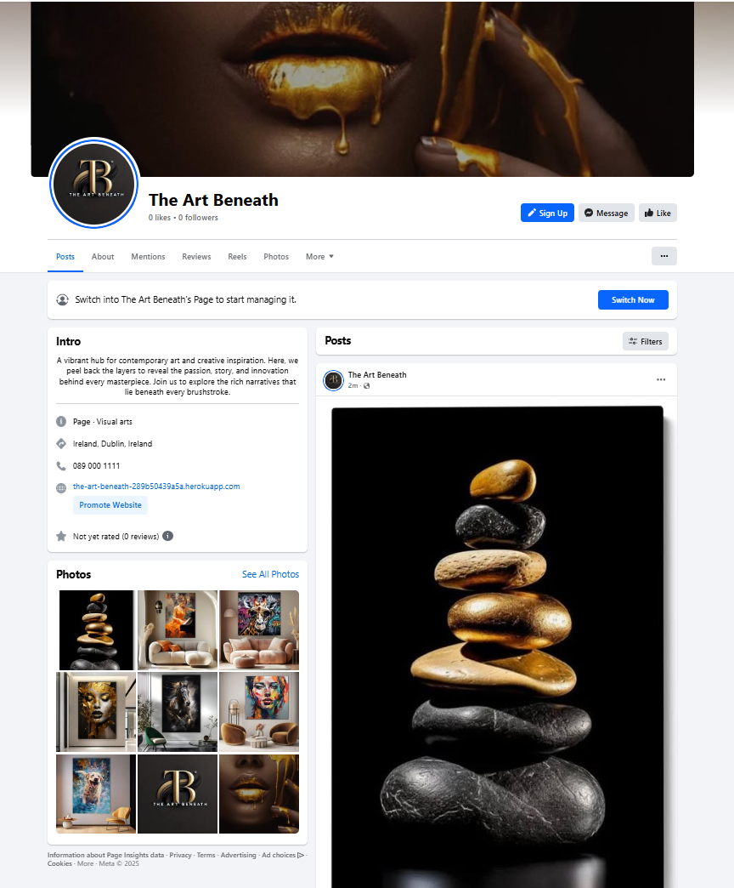
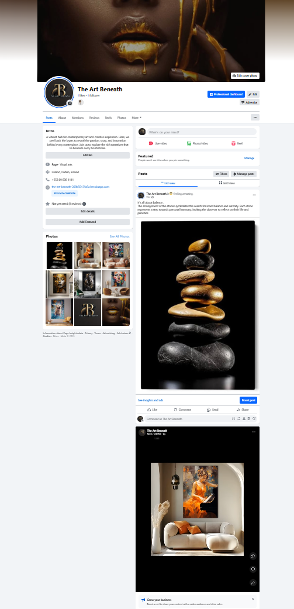

# The Art Beneath


Live website can be accessed here: [The Art Beneath](https://the-art-beneath-289b50439a5a.herokuapp.com)


## Contents

- [Overview](#overview)
- [User Experience (UX)](#user-experience-ux)
   * [User Stories](#user-stories)

- [Design](#design)
   * [Colour Scheme](#colour-scheme)
   * [Typography](#typography)
   * [Imagery](#imagery)
   * [Wireframes](#wireframes)
   * [Database Schema](#database-schema)

- [Features](#features)
   * [Home Page](#home-page)
   * [AI Tools Page](#ai-tools-page)
   * [Voting and Ranking](#voting-and-ranking)
   * [About Page](#about-page)
   * [Contact Page](#contact-page)
   * [Features to Add](#features-to-add)

- [Technologies](#technologies)
   * [Languages Used](#languages-used)
   * [Libraries & Programs Used](#libraries-and-programs-used)

- [Testing](#testing)

- [Deployment](#deployment)
   * [Deployment Process](#deployment-process)
   * [Forking](#forking)
   * [Clone](#clone)

- [Credits](#credits)
   * [Code](#code)
   * [Media](#media)

---


## Overview
The Art Beneath is a modern e-commerce platform dedicated to showcasing and selling contemporary art created by an artist, James Stanislaw. Inspired by my partner, an artist himself, this project aims to provide a seamless experience for art enthusiasts to browse, explore, and purchase unique pieces. 

The platform is designed to cater to art lovers who appreciate fine art, providing a secure and efficient way to connect with the work of James Stanislaw.

The inspiration for "The Art Beneath" comes from the idea that every artwork has layers of meaning and depth that go beyond the surface. The platform serves as a space to explore the unique and thought-provoking pieces created by James Stanislaw.

---

# User Experience (UX)  
The website is designed to provide an intuitive and visually appealing way for users to browse and purchase artwork. The primary goal is to create a seamless shopping experience that highlights the artistic details of each piece while maintaining an efficient e-commerce functionality.

## User Stories

A list of user stories grouped into epics for better structure and clarity.

### EPIC | Browsing and Viewing Art
- As a shopper, I want to browse through a collection of art pieces so that I can pick some to buy.
- As a shopper, I want to access detailed information about an art piece so that I can learn its price, description, and other relevant details.
- As a shopper, I want to be able to easily find an art piece that belongs to a certain category so that I can quickly find a piece that I am interested in, without searching through all the art pieces.

### EPIC | Managing Cart and Purchases
- As a shopper, I want to quickly see the total cost of my selected items so that I can manage my budget.
- As a shopper, I want to choose the size and quantity of an art piece so that I purchase exactly what I need.
- As a shopper, I want to review the contents of my shopping bag so that I know what I’m about to purchase.
- As a shopper, I want to modify the quantity of items in my bag so that I can finalize my purchase without mistakes.
- As a shopper, I want to provide payment details securely so that I can complete my purchase confidently.
- As a shopper, I want to trust that my payment information is secure so that I feel safe making purchases online.
- As a shopper, I want to see a confirmation after I complete checkout so that I can verify the order details.
- As a shopper, I want to receive a confirmation email after buying so that I have a record of my purchase.

### EPIC | User Account Management
- As a site user, I want to sign up for an account easily so that I can access my personal profile and order details.
- As a site user, I want to log in and out of my account effortlessly so that I can access my information securely.
- As a site user, I want to recover my password if forgotten so that I can regain access to my account.
- As a site user, I want to receive an email confirming my registration so that I know my account setup was successful.
- As a site user, I want to access a personalized profile so that I can view my order history and save payment methods securely.

### EPIC | Search and Sort Features
- As a shopper, I want to sort through the available art pieces so that I can find items that suit my preferences or budget.
- As a shopper, I want to arrange art pieces within a specific category so that I can discover items by price, name, or other criteria.
- As a shopper, I want to combine filters with categories so that I can view a refined list of art pieces matching my preferences.
- As a shopper, I want to search for art pieces using keywords so that I can quickly find specific items.
- As a shopper, I want to see my search terms and the number of matching results so that I can gauge whether the desired item is available.

### EPIC | Store Management
- As a store owner, I want to add new art pieces to the store so that customers can see and purchase them.
- As a store owner, I want to update details of existing art pieces so that I can keep the listings accurate and up-to-date.
- As a store owner, I want to remove art pieces that are no longer available so that the store listings stay current.
- As a shopper, I want to save art pieces to my wishlist so that I can easily revisit and purchase them later.



<!---------- done up to now------------------------------>

[Back to top ⇧](#the-art-beneath)

## Navigation & Accessibility
- A well-organized navigation menu allows users to easily access categories, shopping cart, and account settings.  
- The design follows modern accessibility standards, ensuring clarity and readability across devices.  
- The website supports intuitive browsing with an efficient search and sorting system.

---

## Design

# Colors Used  
The color scheme follows a **modern, dark-themed aesthetic**, providing a sophisticated and artistic feel.


- **Primary Color:** `#1D1D1E` – Forms the deep, rich background, creating a sleek and immersive atmosphere.  
- **Secondary Color:** `#333333` – Used for contrast and subtle UI elements, ensuring a modern, balanced composition.  
- **Accent Color:** `#242424` – Applied to interactive elements and sections, enhancing depth and visual hierarchy.  
- **Typography Color:** Light Gray (`#E0E0E0`) – Ensures high readability on dark backgrounds.  
- **Highlight Color:** Gold (`#FFD700`) – Used for key actions and to add a premium artistic touch.

These colors work together to create a **sophisticated and elegant** shopping experience, ensuring both functionality and visual appeal.

---

# Typography  
A combination of two elegant and readable fonts ensures a sophisticated yet modern look.

- **Logo & Key Headings:** *Tenor Sans* – Used for elements like “Shop Now” and main page text to convey a refined, artistic style.  
- **Navigation Bar & Descriptive Text:** *Raleway* – A clean, modern sans-serif font for improved readability in product descriptions and navigation.

---

# Design & Inspiration  
The visual concept of the website is inspired by **The Code Institute’s Boutique Ado walkthrough**, but with a **personalized artistic touch** to reflect a modern dark-themed gallery. The layout balances artistic presentation with functional e-commerce usability.

- **Artistic Modern Design** – A minimalist dark theme highlights artwork without distractions.  
- **Enhanced User Flow** – Users can easily explore, filter, and purchase artworks in a smooth, engaging manner.  
- **E-commerce Optimization** – Clear calls-to-action and a structured checkout process ensure conversion efficiency.

---

## Imagery  
The imagery selection focuses on **high-quality, visually rich representations of artwork** to immerse users in the artistic experience. Detailed descriptions help users understand each piece's meaning, colors, and artistic intent.

## Wireframes
- **Home**: 

- **Gallery**: 

- **About**: 

- **Art Detail**: 

- **FAQ**: 

- **Contact**: 


---

## Database Schema 


[Back to top ⇧](#the-art-beneath)

## Features  
This section outlines the **core functionalities** of the platform.

### __Home Page__  
  
  -  A visually striking hero section welcomes users with a title and a brief message that evokes curiosity. 
  - A "Shop Now" button is available for users to interact with from the start. **"Shop Now"** button.  
- **Navigation Bar**: Access to Home, Gallery, Categories, Search, Cart, Wishlist, Profile, and Admin controls (if applicable).  

### __Gallery__  
  
- Displays **art pieces with images, names, prices**, and purchase options.  
- Logged-in users can view detailed descriptions and add items to their cart or wishlist.  
- **Admin controls**: Edit or delete art pieces.

### __Art Details Page__  
  
- **Comprehensive view** of artwork, including price, description, size, and color details.  
- **Logged-in users** can add items to the cart.  

### __Category & Filter-Based Browsing__   
- Users can **browse by category** (e.g., Nature, Female, Animals).  
- **Filters** allow sorting by **price, orientation, or new arrivals**.  

### __Shopping Bag & Secure Checkout__  
  
- View selected items, adjust quantity, and see total cost dynamically.
- when item is added to the basket, bad changes color to reflect it.   
- **Secure payment options** including credit/debit cards and PayPal.  
- Encrypted transactions with **HTTPS/SSL** protection.  

### __Order Confirmation & Notifications__  
  
- Order confirmation with a **personalized message from the artist**.  
- **Email notifications** with purchase details and estimated delivery.  

### __Wishlist Feature__  
  
- **Logged-in users** can save and revisit their favorite art pieces.

### __User Account Management__  
- **Single access point** for **Login, Register, Logout, Add Art(admin)**.  
- Password reset and profile updates available.  
- Users can **track order history**.  

### __Contact & FAQ__  
- **Contact Form**: Users can reach out to the site owner (pre-filled for logged-in users).  
- **FAQ Section**: Answers common queries about products and services.  

### __Footer__  
- **Links to social media, newsletter subscription, and copyright information.**  
---

### __Newsletter Subscription__
- Users can subscribe to receive updates and offers.

---
### Features Left to Implement
- User reviews and ratings for art pieces
- Social media sharing options
- AI-powered art recommendations based on browsing history

---


# The Art Beneath – SEO & Marketing Strategy  

## **Business Model**  

The Art Beneath follows an **E-commerce Business to Customer (B2C) model**, offering unique art pieces directly to customers.  
The platform allows users to **browse, purchase, and engage** with contemporary visual art while providing insights into the deeper meaning behind each creation.  

A strong **social media presence** and **search engine optimization (SEO)** strategy will help build an engaged community and drive potential buyers to the site.  

---

## **Search Engine Optimization (SEO) Strategy**  

### **1. Keyword Research & Optimization**  

To improve search engine rankings and increase visibility, we focused on:  

- **Short-tail keywords:** "Modern Art," "Digital Art," "Gold Art"  
- **Long-tail keywords:** "Luxury abstract wall art," "Contemporary digital paintings for home decor"  

Example of an optimized product description:  
🚀 *"Transform your space with this luxurious **gold and black abstract art piece** – a contemporary blend of elegance and artistic depth."*  





## Languages 
- HTML, CSS, JavaScript, Bootstrap;

### Libraries and Programs Used

- [Git](https://git-scm.com/)
  - Version control.
- [GitHub](https://github.com/)
  - For storing code and deploying the site.
- [Gitpod](https://www.gitpod.io/)
  - Used for building and editing my code.
- [Django](https://www.djangoproject.com/)
  - A python based framework that was used to develop the site.
- [Bootstrap](https://getbootstrap.com/)
  - For help designing the html templates.
- [Google Fonts](https://fonts.google.com/)
  - Used to style the website's logo.
- [Font Awesome](https://fontawesome.com/)
  - Used to obtain the icons used.
- [Google Developer Tools](https://developers.google.com/web/tools/chrome-devtools)
  - Used to help fix problem areas and identify bugs.
- [Cloudinary](https://cloudinary.com/)
  - Used to store static files and images.
- [Favicon.io](https://favicon.io/)
  - Used to generate the site's favicon.
- [SQlite](https://www.sqlite.org/index.html)
  - Used when performing unit tests.
- [PostgreSQL](https://postgresql.org/)
  - Database used through heroku.
- [Lucidchart](https://lucidchart.com/)
  - To draw out the database schema.
- [W3C Markup Validation Service](https://validator.w3.org/) 
  - Used to validate HTML code.
- [W3C CSS Validation Service](https://jigsaw.w3.org/css-validator/#validate_by_input)
  - Used to validate CSS code.
- [Pep8](http://pep8online.com/)
  - Used to validate Python code.
- [JSHint](https://jshint.com/)
  - Used to validate JS code.
- [Tinyjpg](https://tinyjpg.com/)
  - Used to compress images.
- [Heroku](https://www.heroku.com/)
  - To deploy the project.
- [Stripe](https://stripe.com/)
  - for payment integartion
- [Canva](https://canva.com/)
  - Used for robot and  background images as well as wireframes and inspiration
- [ChatGPT](https://chatgpt.com/)
  - Used for general queries and quick help.
- [Claude3.5](https://claude.ai/)
  - For insightful explanations of topic. 
- [ YouTube](https://www.youtube.com/) 
  - For tutorials and other learnigs. 

---

## Testing
Comprehensive testing has been conducted to ensure a smooth user experience.

Return back to the [TESTING.md](TESTING.md) 

---

## Deployment

The live deployed application can be found deployed on [Heroku](https://the-art-beneath-289b50439a5a.herokuapp.com).

### ElephantSQL Database

This project uses [ElephantSQL](https://www.elephantsql.com) for the PostgreSQL Database.

To obtain your own Postgres Database, sign-up with your GitHub account, then follow these steps:

- Click **Create New Instance** to start a new database.
- Provide a name (this is commonly the name of the project: web-piano-academy).
- Select the **Tiny Turtle (Free)** plan.
- You can leave the **Tags** blank.
- Select the **Region** and **Data Center** closest to you.
- Once created, click on the new database name, where you can view the database URL and Password.

### Gmail API

This project uses [Gmail](https://mail.google.com) to handle sending emails to users for account verification and purchase order confirmations.

Once you've created a Gmail (Google) account and logged-in, follow these series of steps to get your project connected.

- Click on the **Account Settings** (cog icon) in the top-right corner of Gmail.
- Click on the **Accounts and Import** tab.
- Within the section called "Change account settings", click on the link for **Other Google Account settings**.
- From this new page, select **Security** on the left.
- Select **2-Step Verification** to turn it on. (verify your password and account)
- Once verified, select **Turn On** for 2FA.
- Navigate back to the **Security** page, and you'll see a new option called **App passwords**.
- This might prompt you once again to confirm your password and account.
- Select **Mail** for the app type.
- Select **Other (Custom name)** for the device type.
	- Any custom name, such as "Django" or web-piano-academy
- You'll be provided with a 16-character password (API key).
	- Save this somewhere locally, as you cannot access this key again later!
	- `EMAIL_HOST_PASS` = user's 16-character API key
	- `EMAIL_HOST_USER` = user's own personal Gmail email address

### Heroku Deployment

This project uses [Heroku](https://www.heroku.com), a platform as a service (PaaS) that enables developers to build, run, and operate applications entirely in the cloud.

Deployment steps are as follows, after account setup:

- Select **New** in the top-right corner of your Heroku Dashboard, and select **Create new app** from the dropdown menu.
- Your app name must be unique, and then choose a region closest to you (EU or USA), and finally, select **Create App**.
- From the new app **Settings**, click **Reveal Config Vars**, and set your environment variables.

| Key | Value |
| --- | --- |
| `DATABASE_URL` | user's own value |
| `DISABLE_COLLECTSTATIC` | 1 (*this is temporary, and can be removed for the final deployment*) |
| `EMAIL_HOST_PASS` | user's own value |
| `EMAIL_HOST_USER` | user's own value |
| `SECRET_KEY` | user's own value |
| `STRIPE_PUBLIC_KEY` | user's own value |
| `STRIPE_SECRET_KEY` | user's own value |
| `STRIPE_WH_SECRET` | user's own value |

Heroku needs two additional files in order to deploy properly.

- requirements.txt
- Procfile

You can install this project's **requirements** (where applicable) using:

- `pip3 install -r requirements.txt`

If you have your own packages that have been installed, then the requirements file needs updated using:

- `pip3 freeze --local > requirements.txt`

The **Procfile** can be created with the following command:

- `echo web: gunicorn app_name.wsgi > Procfile`
- *replace **app_name** with the name of your primary Django app name; the folder where settings.py is located*

For Heroku deployment, follow these steps to connect your own GitHub repository to the newly created app:

Either:

- Select **Automatic Deployment** from the Heroku app.

Or:

- In the Terminal/CLI, connect to Heroku using this command: `heroku login -i`
- Set the remote for Heroku: `heroku git:remote -a app_name` (replace *app_name* with your app name)
- After performing the standard Git `add`, `commit`, and `push` to GitHub, you can now type:
	- `git push heroku main`

The project should now be connected and deployed to Heroku!

### Local Deployment

This project can be cloned or forked in order to make a local copy on your own system.

For either method, you will need to install any applicable packages found within the *requirements.txt* file.

- `pip3 install -r requirements.txt`.

You will need to create a new file called `env.py` at the root-level,
and include the same environment variables listed above from the Heroku deployment steps.

Sample `env.py` file:

```python
import os

os.environ.setdefault("DATABASE_URL", "user's own value")
os.environ.setdefault("EMAIL_HOST_PASS", "user's own value")
os.environ.setdefault("EMAIL_HOST_USER", "user's own value")
os.environ.setdefault("SECRET_KEY", "user's own value")
os.environ.setdefault("STRIPE_PUBLIC_KEY", "user's own value")
os.environ.setdefault("STRIPE_SECRET_KEY", "user's own value")
os.environ.setdefault("STRIPE_WH_SECRET", "user's own value")

# local environment only (do not include these in production/deployment!)
os.environ.setdefault("DEBUG", "True")
```

Once the project is cloned or forked, in order to run it locally, you'll need to follow these steps:

- Start the Django app: `python3 manage.py runserver`
- Stop the app once it's loaded: `CTRL+C` or `⌘+C` (Mac)
- Make any necessary migrations: `python3 manage.py makemigrations`
- Migrate the data to the database: `python3 manage.py migrate`
- Create a superuser: `python3 manage.py createsuperuser`
- Load fixtures (if applicable): `python3 manage.py loaddata file-name.json` (repeat for each file)
- Everything should be ready now, so run the Django app again: `python3 manage.py runserver`

If you'd like to backup your database models, use the following command for each model you'd like to create a fixture for:

- `python3 manage.py dumpdata your-model > your-model.json`
- *repeat this action for each model you wish to backup*

#### Cloning

You can clone the repository by following these steps:

1. Go to the [GitHub repository](https://github.com/LewisMDillon/web-piano-academy) 
2. Locate the Code button above the list of files and click it 
3. Select if you prefer to clone using HTTPS, SSH, or GitHub CLI and click the copy button to copy the URL to your clipboard
4. Open Git Bash or Terminal
5. Change the current working directory to the one where you want the cloned directory
6. In your IDE Terminal, type the following command to clone my repository:
	- `git clone https://github.com/LewisMDillon/web-piano-academy.git`
7. Press Enter to create your local clone.

Alternatively, if using Gitpod, you can click below to create your own workspace using this repository.

[](https://gitpod.io/#https://github.com/LewisMDillon/web-piano-academy)

Please note that in order to directly open the project in Gitpod, you need to have the browser extension installed.
A tutorial on how to do that can be found [here](https://www.gitpod.io/docs/configure/user-settings/browser-extension).

#### Forking

By forking the GitHub Repository, we make a copy of the original repository on our GitHub account to view and/or make changes without affecting the original owner's repository.
You can fork this repository by using the following steps:

1. Log in to GitHub and locate the [GitHub Repository](https://github.com/LewisMDillon/web-piano-academy)
2. At the top of the Repository (not top of page) just above the "Settings" Button on the menu, locate the "Fork" Button.
3. Once clicked, you should now have a copy of the original repository in your own GitHub account!

## Credits

---

## Credits
### Content
- Product descriptions written for the fictional artist James Stanislaw.
- all images and details were modeled from [Cupido Design](https://cupidodesign.com/en)
- Images created as part of the fictional artist’s collection.
- Icons sourced from [Font Awesome](https://fontawesome.com/).
- Code styel ,inspiration and support:
  - [Chrono](https://organicthemes.com/demo/chrono/)
  - [Piano Academy](https://github.com/LewisMDillon/web-piano-academy)
  - [Everneed](https://github.com/amylour/everneed/tree/main)
  - [Three Oaks](https://bonsai-shop.up.railway.app/accounts/login/)
---

### Acknowledgements
