# Testing

This is the TESTING file for the [The Art Beneath](https://the-art-beneath-289b50439a5a.herokuapp.com/) website.

Return back to the [README.md](README.md) file.

## Testing Contents  
  
- [Testing](#testing)
  - [Testing Contents](#testing-contents)
  - [Validation](#validation)
    - [HTML Validation](#html-validation)
    - [JavaScript Validation](#javascript-validation)
    - [Python Validation](#python-validation)
    - [CSS Validation](#css-validation)
    - [Lighthouse Scores](#lighthouse-scores)
  - [Manual Testing](#manual-testing)
   
    - [Browser Compatibility](#browser-compatibility)
    - [Responsiveness](#responsiveness)
    - [Testing User Stories](#testing-user-stories)
    - [User Input/Form Validation](#user-inputform-validation)
    - [Unresolved/Known Bugs](#unresolvedknown-bugs)

## Validation

### HTML

I have used the recommended [HTML W3C Validator](https://validator.w3.org) to validate all of my HTML files via url.
*please note when validating via url , both art details and sign up throw an error:*
art_detail error 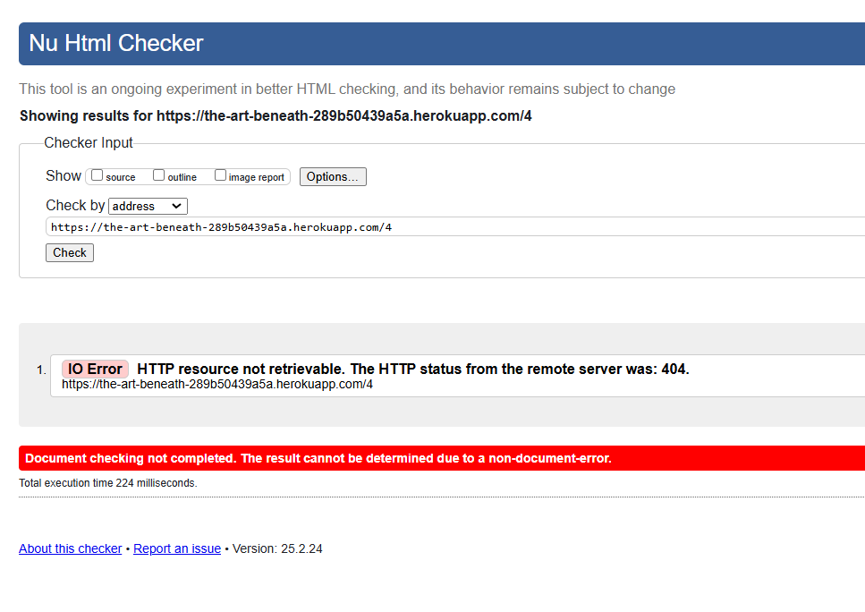
signup_url error 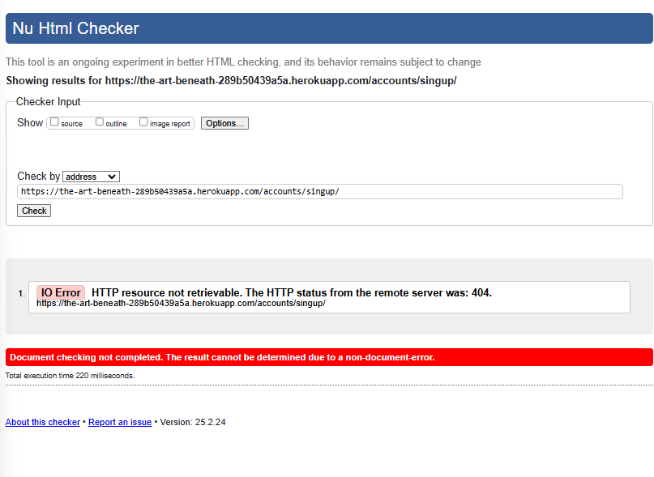

- *Once validating via direct input, all is good* :

| Page           | Screenshot                                     | Notes              |
|----------------|------------------------------------------------|--------------------|
| about          | 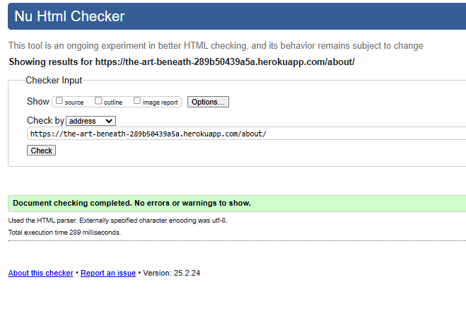 | Pass: No Errors   |
| art_detail     | 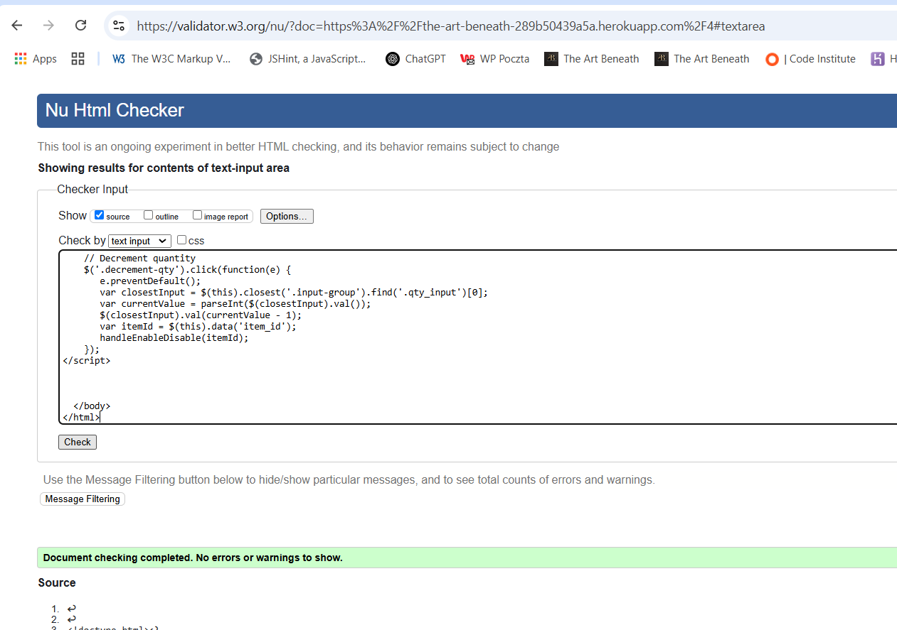 | Pass: No Errors * |
| art_managament | 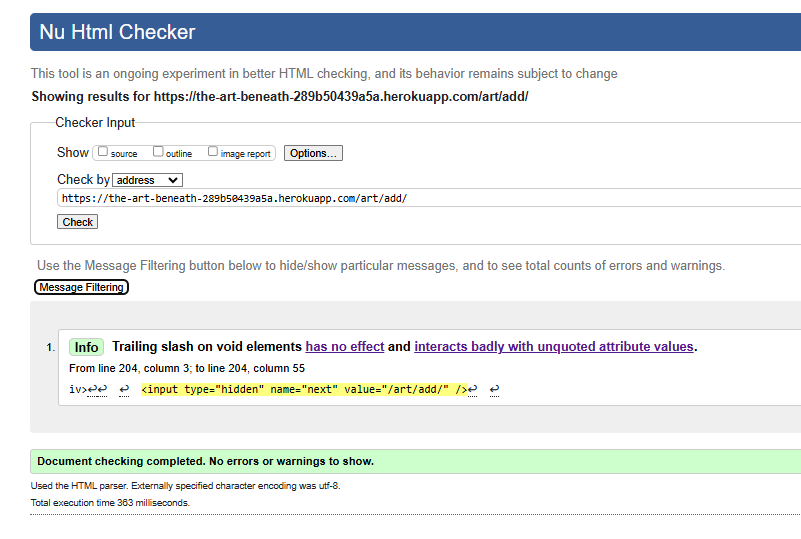 | Pass: No Errors   |
| contact        | 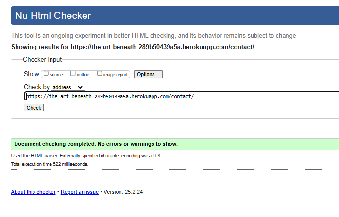 | Pass: No Errors   |
| faq            | 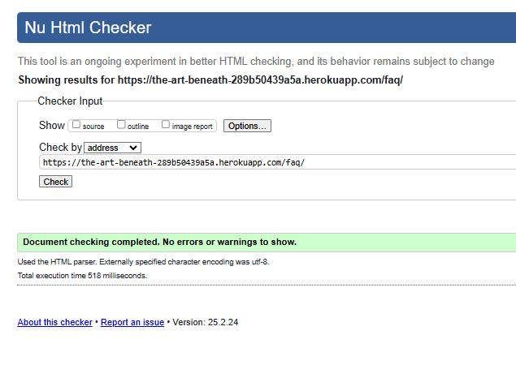 | Pass: No Errors   |
| filter         | 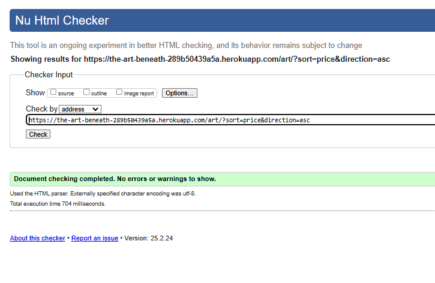 | Pass: No Errors   |
| gallery        | 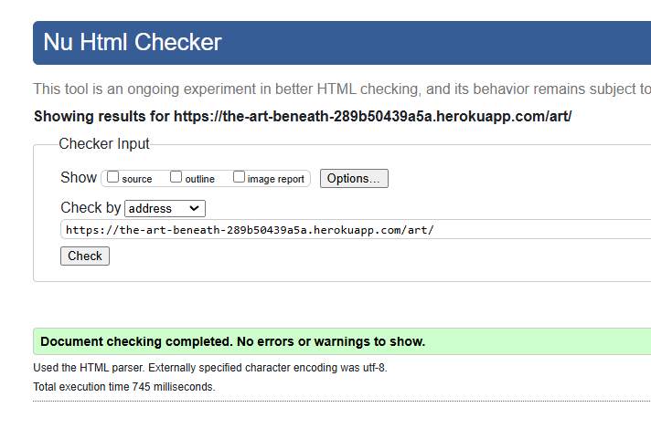 | Pass: No Errors   |
| home           | 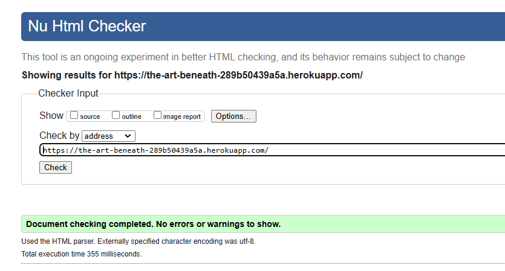 | Pass: No Errors   |
| login          | 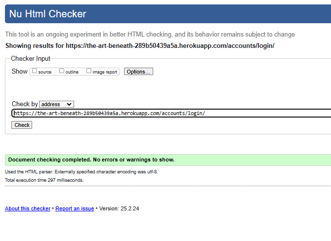 | Pass: No Errors   |
| logout         |  | Pass: No Errors   |
| profile        | 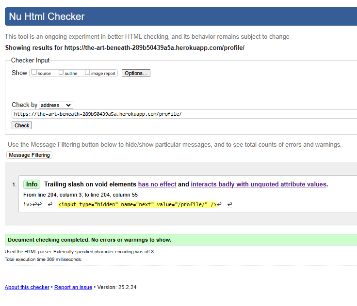 | Pass: No Errors   |
| signup         | 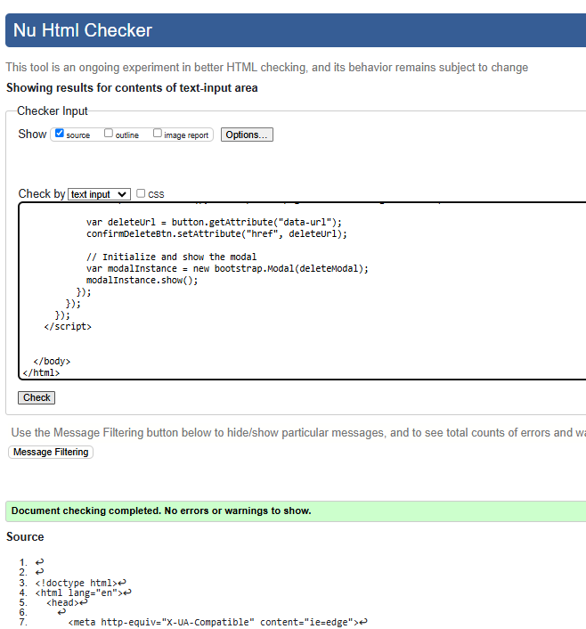 | Pass: No Errors *  |
| wishlist       | 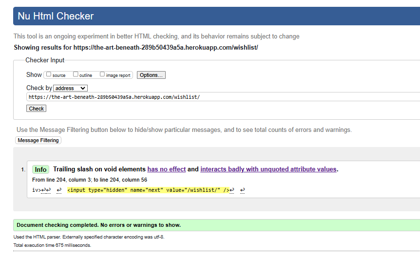 | Pass: No Errors   |

### CSS

I have used the recommended [CSS Jigsaw Validator](https://jigsaw.w3.org/css-validator) to validate all of my CSS files.

| File | Screenshot | Notes |
| --- | --- | --- |
| base.css | 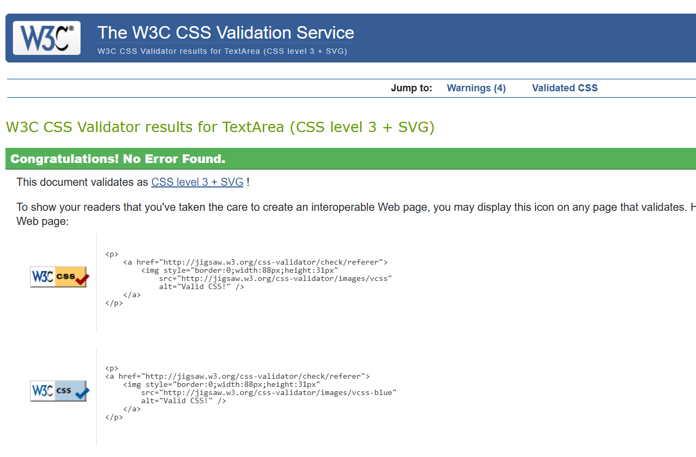 | Pass: No Errors |
| checkout.css | 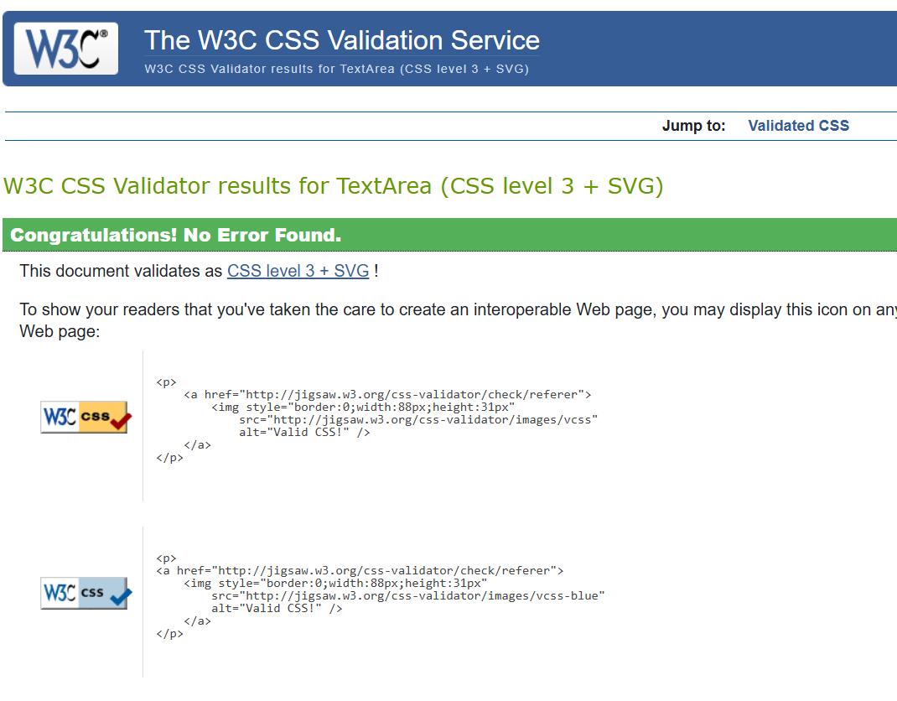 | Pass: No Errors |
| profile.css | 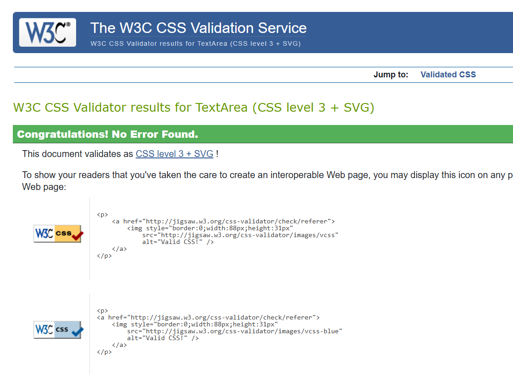 | Pass: No Errors |

### JS
I have used the recommended [JShint Validator](https://jshint.com) to validate all of my JS files. Needed for testing at the top of the file: (/* jshint esversion: 11, jquery: true */)

| File | Screenshot | Notes |
| --- | --- | --- |
| stripe_elements.js | 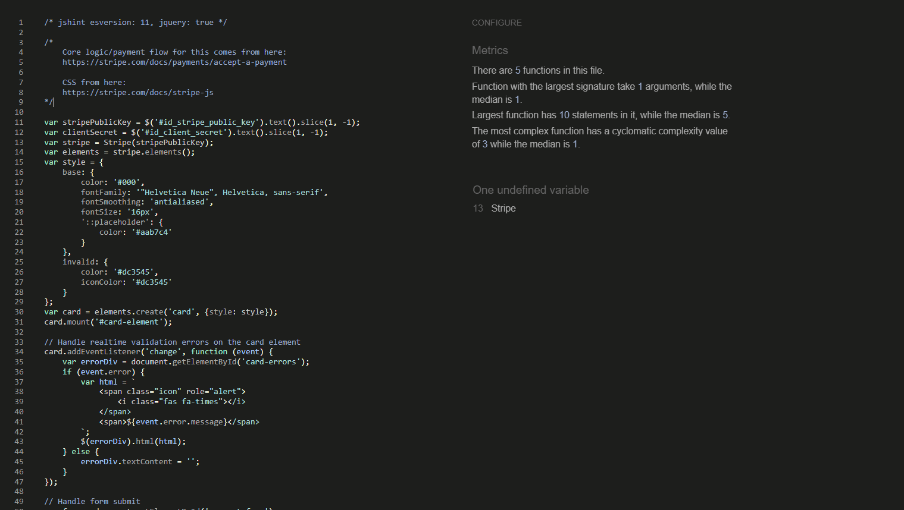 | No Errors |
| countryfield.js | 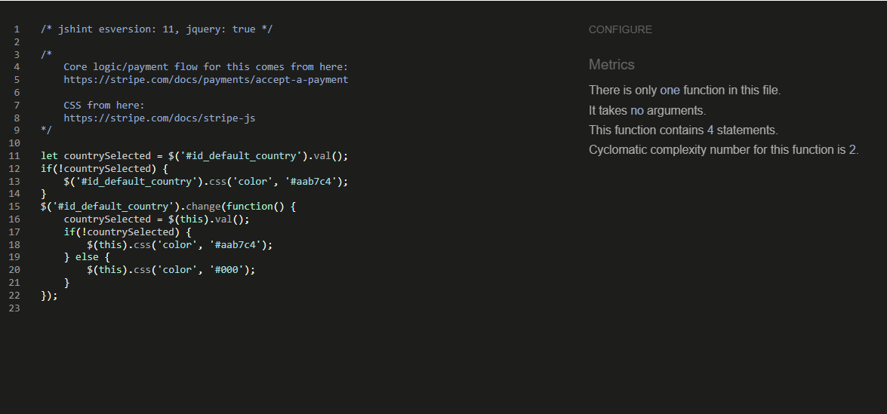 | Pass: No Errors |

### Python Validation

[CI Python Linter](https://pep8ci.herokuapp.com/#) was used to validate the Python files that were created or edited by myself. No errors were found. Due to extensive amount of screenshots I had chosen to include the table instead that I had validates one by one, but to backup my findings I also ran code via Flake8 (code made by me have no erros that I am in control of); 

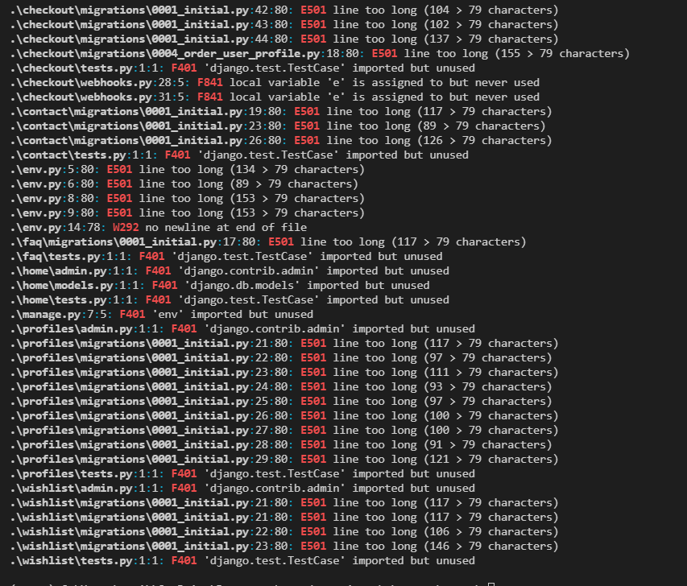
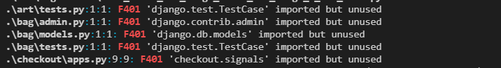
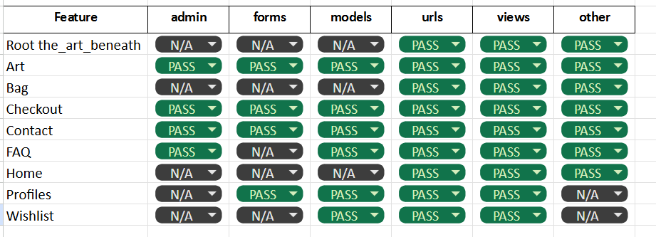

### Lighthouse Scores

Lighthouse testing was carried out in Incognito mode to achieve the best result. Images used in the site's design were saved in png format, and compressed using [tinypng](https://tinypng.com/) to offer the best chance for a decent performance score. I am not happy with the results of the testing as they seem to be very low. My aim is to have a very high quality , large images so I will need to work around it to ensure that wont affect loading time and overall health of the website.  I will carry additional improvements in the fututre to acheive minimum of 85% for the best experience. 

### **Home Page**
- **Desktop:** 
- **Mobile:** 

### **Art Listing Page**
- **Desktop:** 
- **Mobile:** 

### **Individual Art Detail Page**
- **Desktop:** 
- **Mobile:** 

### **Login/Register Pages**
- **Desktop:** 
- **Mobile:** 

### Browser Compatibility

Website was tested  on various different devices, including listed below, features were accessible and working as intended:

- Chrome , Safari, Firefox ,Edge

### Responsiveness
 
# Responsiveness Test Results

## **Home Page**

## **Art Detail Page**

## **Gallery Page**

## **Shopping Bag Page**

## **About Page**

### Testing User Stories

User Stories are documented in The Art Beneath [GitHub Projects Board](https://github.com/users/monika-mak/projects/5)
Each story is devided clearly into epics for clarity.
Wishlist came as a late addition as it was not originally planned. I am glad i had implemtned it. 

| User Story                 | Acceptance Criteria Met?  | Tested | Response     | Pass/Fail | Fix     |
|----------------------------|---------------------------|--------|--------------|-----------|---------|
| As a **shopper**, I can **browse through a collection of art pieces** so that I can **pick some to buy**. | Yes | Yes | 'Art' page displays all available pieces with names, images, and prices. | Pass | n/a |
| As a **shopper**, I can **click on an art piece to see more details** so that I can **learn about its price, description, and other relevant details**. | Yes | Yes | Clicking on an art piece leads to a detail page with name, price, description, size, images, and add-to-cart option. | Pass | n/a |
| As a **shopper**, I can **view art pieces by categories** so that I can **find specific themes easily**. | Yes | Yes | Clicking on a category displays all related art pieces. | Pass | n/a |
| As a **shopper**, I can **see the total cost of my selected items** so that I can **manage my budget**. | Yes | Yes | Shopping cart icon displays running total and updates dynamically. | Pass | n/a |
| As a **shopper**, I can **choose the size and quantity of an art piece** so that I can **purchase exactly what I need**. | Yes | Yes | Size options and quantity selector available and confirmed in cart. | Pass | n/a |
| As a **shopper**, I can **review items in my shopping bag** so that I can **verify what I’m about to purchase**. | Yes | Yes | Shopping bag lists item details and updates costs in real-time. | Pass | n/a |
| As a **shopper**, I can **adjust the quantity of items in my bag** so that I can **finalize my purchase correctly**. | Yes | Yes | Items can be increased, decreased, or removed, with instant cost updates and a notification. | Pass | n/a |
| As a **shopper**, I can **securely enter payment details** so that I can **complete my purchase confidently**. | Yes | Yes | Checkout page provides a secure payment form with validation. | Pass | n/a |
| As a **shopper**, I can **trust that my payment information is secure** so that I can **feel safe purchasing online**. | Yes | Yes | Data encryption, secure tokenization, and privacy policy in place. | Pass | n/a |
| As a **shopper**, I can **see a confirmation after checkout** so that I can **verify my order details**. | Yes | Yes | Confirmation page displays purchased items, costs, and delivery details. | Pass | n/a |
| As a **shopper**, I can **receive an order confirmation email** so that I can **have a record of my purchase**. | Yes | Yes | Automated email sent with order summary and tracking details. | Pass | n/a |
| As a **site user**, I can **register for an account** so that I can **access my profile and order details**. | Yes | Yes | Sign-up form requires email, username, and password; confirmation email sent. | Pass | n/a |
| As a **site user**, I can **log in and log out easily** so that I can **access my information securely**. | Yes | Yes | Login page verifies credentials; logout button returns user to homepage. | Pass | n/a |
| As a **site user**, I can **recover my password if forgotten** so that I can **regain access to my account**. | Yes | Yes | 'Forgot Password' feature sends secure reset link. | Pass | n/a |
| As a **site user**, I can **receive an email confirming my registration** so that I know **my account setup was successful**. | Yes | Yes | Welcome email is sent after successful registration. | Pass | n/a |
| As a **site user**, I can **access a personalized profile** so that I can **view my order history and save payment methods securely**. | Yes | Yes | 'My Account' section displays past orders and allows updates. | Pass | n/a |
| As a **shopper**, I can **sort art pieces** so that I can **find items that suit my preferences or budget**. | Yes | Yes | Sorting options like 'Lowest Price First' are available and functional. | Pass | n/a |
| As a **shopper**, I can **filter and sort within a specific category** so that I can **refine my selection**. | Yes | Yes | Category filtering and sorting options work as expected. | Pass | n/a |
| As a **shopper**, I can **search for art pieces using keywords** so that I can **quickly find specific items**. | Yes | Yes | Search bar returns relevant results based on name or description. | Pass | n/a |
| As a **store owner**, I can **add new art pieces to the store** so that I can **increase my inventory**. | Yes | Yes | 'Add Art' form allows new entries, with error handling for missing fields. | Pass | n/a |
| As a **store owner**, I can **edit/update an art piece** so that I can **keep listings accurate**. | Yes | Yes | Art management panel allows edits, which update immediately. | Pass | n/a |
| As a **store owner**, I can **delete an art piece** so that I can **remove unavailable items**. | Yes | Yes | Delete option includes confirmation prompt and removes item from store view. | Pass | n/a |
| As a **shopper**, I can **save art pieces to my wishlist** so that I can **easily revisit and purchase them later**. | Yes | Yes | 'Save to Wishlist' button adds item for logged-in users, accessible from account section. | Pass | n/a |

All user stories have been tested to ensure they meet the expected criteria.

## Manual Testing

### User Input/Form Validation

Testing was carried out on desktop using a Chrome browser to ensure all forms take the intended input and process the input appropriately.

| Feature                    | Tested?  | User Input Required | User Feedback Provided     | Pass/Fail | Fix |
|----------------------------|----------|---------------------|----------------------------|-----------|-----|
| Navbar Logo and Icons      | Yes      | Click Links bring user to correct destination    | Text Colour Change/Icon Animation/Dropdowns | Pass | N/A |
| Home Page                  | Yes      | Hover/Click interactive features | Accordion FAQ section | Pass | N/A |
| Register Page              | Yes      | Text Input/Click Links | Form field highlight/Font weight change on hover/Toast message | Pass | N/A |
| Email Validate             | Yes      | Click Links | Button animation/Toast message | Pass | N/A |
| Forgot Password            | Yes      | Text Input/Click Links | Form field highlight/Button animation/Toast message | Pass | N/A |
| Log In Page                | Yes      | Text Input/Click Links | Form field highlight/Font weight on hover/Toast message | Pass | N/A |
| Log Out Page               | Yes      | Click Links bring user to correct destination | Button animation/Font color change/Toast message | Pass | N/A |
| Account - Edit Address     | Yes      | Text Input/Click to Save | Form field highlight/Button animation/Toast message | Pass | N/A |
| Search                     | Yes      | Text Input/Click to Search | Pop up Modal/Form field highlight/Button Animation | Pass | N/A |
| Contact Us Form            | Yes      | Text Input/Click to Send | Pop up Modal/Form field highlight/Button animation | Pass | N/A |
| Newsletter Sign Up         | Yes      | Text Input/ Click to Subscribe | Button animation/New pop up, subscription confirmation | Pass | N/A |
| Admin            | Yes      | Click Links brings user to correct URL | Button animation on hover | Pass | N/A |
| Art                        | Yes      | Click art brings user to art description | Pointer change on hover of art , image lifts| Pass | N/A |
| Add Art                    | Yes      | Navigated Art Managament, Completed form, Form submits correctly to display the art. | Form field highlight/Button animation/Toast message, new art uploaded. | Pass | N/A |
| Edit Art               | Yes      | Navigated to Gallery, clicked on pen icon underneath each art piece,  Completed form, Form submits correctly to display the edited art. | Form field highlight/Button animation/Toast message, art updated. | Pass | N/a |
| View Art               | Yes      | Click  image | Article card border change on hover | Pass | N/A |
| Art Quantity           | Yes      | Click increment/decrement | Colour change on hover/art quantity successfully changed | Pass | N/A |
| Checkout                   | Yes      | Click 'Secure Checkout', correct art in bag, entered delivery and payment details, submitted form to process payment. | Form field highlight/Button animation/Toast message, Loading spinner when processing order, order processed saved to account and email sent. | Pass | N/A |
| Footer                     | Yes      | Click FB Link brings user to faceboock page   | Font colour change on hover | Pass | N/A |

### Unresolved/Known Bugs

Some adjsutemnt needed in About section,  Image is too small on desktop; 
Shopping cart footer needs to be pushed down. I had spend quite a lot of time fixing it only to findout it affected  other impotant aspects. 
Similary had a huge issue with images on my detail page. Sicne i decided to use multiple images and have the ones not displaying being placed underneath of main image I did ot manage to do it without a warning coming up due to double id. The fact is that in the detail page, the main image will always have a copy underneath. This  
Since a lot of time was involved to getting it right I had decided to let it go back to it with a fresh, rested mind once all is done. 

