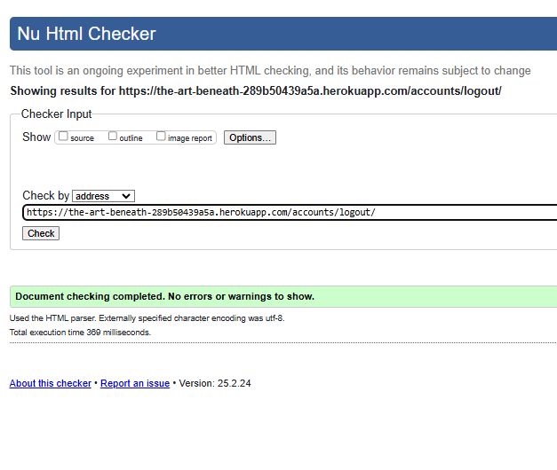

# Testing

This is the TESTING file for the [everneed]() website.

Return back to the [README.md](README.md) file.

## Testing Contents  
  
- [Testing](#testing)
  - [Testing Contents](#testing-contents)
  - [Validation](#validation)
    - [HTML Validation](#html-validation)
    - [JavaScript Validation](#javascript-validation)
    - [Python Validation](#python-validation)
    - [CSS Validation](#css-validation)
    - [Lighthouse Scores](#lighthouse-scores)
    - [Wave Accessibility Score](#wave-accessibility-score)
  - [Manual Testing](#manual-testing)
    - [User Input/Form Validation](#user-inputform-validation)
    - [Browser Compatibility](#browser-compatibility)
    - [Responsiveness](#responsiveness)
    - [Testing User Stories](#testing-user-stories)
    - [Dev Tools/Real World Device Testing](#dev-toolsreal-world-device-testing)
  - [Bugs](#bugs)
    - [Unresolved/Known Bugs](#unresolvedknown-bugs)

## Validation

### HTML

I have used the recommended [HTML W3C Validator](https://validator.w3.org) to validate all of my HTML files via url.
- *please note when validating via url , both art details and sign up throw an error, but once validating via direct input, all is good* 
art_detail error [screenshot](documentation/w3c_art_detail_url_error.png)
signup_url error [screenshot](documentation/w3c_signup_url_error.png)

---

| Page           | Screenshot                                     | Notes              |
|----------------|------------------------------------------------|--------------------|
| about          |  | Pass: No Errors   |
| art_detail     |  | Pass: No Errors * |
| art_managament |  | Pass: No Errors   |
| contact        |  | Pass: No Errors   |
| faq            |  | Pass: No Errors   |
| filter         |  | Pass: No Errors   |
| gallery        |  | Pass: No Errors   |
| home           |  | Pass: No Errors   |
| login          |  | Pass: No Errors   |
| logout         |  | Pass: No Errors   |
| profile        |  | Pass: No Errors   |
| signup         |  | Pass: No Errors *  |
| wishlist       |  | Pass: No Errors   |

### CSS

I have used the recommended [CSS Jigsaw Validator](https://jigsaw.w3.org/css-validator) to validate all of my CSS files.

| File | Screenshot | Notes |
| --- | --- | --- |
| style.css |  | Pass: No Errors |
| checkout.css | | Pass: No Errors |
| profile.css |  | Pass: No Err### JavaScript

### JS
I have used the recommended [JShint Validator](https://jshint.com) to validate all of my JS files. Needed for testing at the top of the file: (/* jshint esversion: 11, jquery: true */)

| File | Screenshot | Notes |
| --- | --- | --- |
| stripe_elements.js |  | No Errors |
| countryfield.js |  | Pass: No Errors |

### Python Validation

[CI Python Linter](https://pep8ci.herokuapp.com/#) was used to validate the Python files that were created or edited by myself. No issues presented, and line lengths were double-checked. No errors were found.

| Feature | admin | forms | models | urls | views | extra |
|---------|----------|----------|-----------|---------|----------|-------|
| Root the_art_beneath | no errors | no errors | no errors | no errors | no errors | no errors |
| Art | no errors | no errors | no errors | no errors | no errors | n/a |
| Bag | n/a | n/a | n/a | no errors | no errors | no errors |
| Checkout | no errors | no errors | no errors | no errors | no errors | no errors | n/a |
| Contact | no errors | no errors | no errors | no errors | no errors | no errors |
| FAQ | no errors | no errors | no errors | no errors | no errors | n/a |
| Home | no errors | no errors | no errors | no errors | no errors | no errors |
| Profiles | no errors | no errors | no errors | no errors | no errors | n/a |
| Wishlist | no errors | no errors | no errors | no errors | no errors | no errors |

### Lighthouse Scores

Lighthouse testing was carried out in Incognito mode to achieve the best result. Images used in the site's design were saved in png format, and compressed using [tinypng](https://tinypng.com/) and [Convertio](https://www.convertio.co) to offer the best chance for a decent performance score.

| Page | Lighthouse Scores - Desktop | Notes |
| ---- | ----------------- | -------- |
| Home |   |      Score lower due to aspect ratio or images, not using webp images and Stripe Cookie    |
| All  |  |  None        |
| Read  |   |   None  |
| Account |              |    As before with Stripe Cookie  |
| Wishlist |   |  As before with images rendering and Stripe Cookie   |

| Page | Lighthouse Scores - Mobile | Notes |
| ---- | ----------------- | -------- |
| Home |   | |
| All  |    | As before  |
| Read |   |  As before  |
| Account |    |  As before  |
| Wishlist |   | As before   |

## Manual Testing

### User Input/Form Validation

Testing was carried out on desktop using a Chrome browser to ensure all forms take the intended input and process the input appropriately.

| Feature                    | Tested?  | User Input Required | User Feedback Provided     | Pass/Fail | Fix |
|----------------------------|----------|---------------------|----------------------------|-----------|-----|
| Navbar Logo and Icons      | Yes      | Click Links bring user to correct destination    | Text Colour Change/Icon Animation/Dropdowns | Pass | N/A |
| Home Page                  | Yes      | Hover/Click interactive features | Carousel moves, Accordion FAQ section | Pass | N/A |
| Register Page              | Yes      | Text Input/Click Links | Form field highlight/Font weight change on hover/Toast message | Pass | N/A |
| Email Validate             | Yes      | Click Links | Button animation/Toast message | Pass | N/A |
| Forgot Password             | Yes     | Text Input/Click Links | Form field highlight/Button animation/Toast message | Pass | N/A |
| Log In Page                | Yes      | Text Input/Click Links | Form field highlight/Font weight on hover/Toast message | Pass | N/A |
| Log Out Page               | Yes      | Click Links bring user to correct destination | Button animation/Font color change/Toast message | Pass | N/A |
| Account - Edit Address     | Yes      | Text Input/Click to Save | Form field highlight/Button animation/Toast message | Pass | N/A |
| Search                     | Yes      | Text Input/Click to Search | Pop up Modal/Form field highlight/Button Animation | Pass | N/A |
| Contact Us Form            | Yes      | Text Input/Click to Save | Pop up Modal/Form field highlight/Button animation | Pass | N/A |
| Newsletter Sign Up         | Yes      | Text Input/ Click to Subscribe | Button animation/New tab subscription confirmation | Pass | N/A |
| Admin Dashboard            | Yes      | Click Links brings user to correct URL | Button animation on hover | Pass | N/A |
| Products                   | Yes      | Click product brings user to product description | Pointer change on hover of products | Pass | N/A |
| Add Product                | Yes      | Navigated to Admin Dashboard, clicked 'Add Product', Completed form, Form submits correctly to display the product. | Form field highlight/Button animation/Toast message, new product uploaded. | Pass | N/A |
| Edit Product               | Yes      | Navigated to Admin Dashboard, clicked 'Edit Product', Completed form, Form submits correctly to display the edited product. | Form field highlight/Button animation/Toast message, product updated. | Pass | N/a |
| View Article               | Yes      | Click link for article | Article card border change on hover | Pass | N/A |
| Add Article                | Yes      | Navigated to Admin Dashboard, clicked 'Add Article', Completed form, Form submits correctly to display the article. | Form field highlight/Button animation/Toast message, new article uploaded. | Pass | N/A |
| Edit Article               | Yes      | Navigated to Admin Dashboard, clicked 'Edit Article', Completed form, Form submits correctly to display the edited article. | Form field highlight/Button animation/Toast message, article edited and uploaded. | Pass | N/A |
| Product Quantity           | Yes      | Click increment/decrement | Colour change on hover/product quantity successfully changed | Pass | N/A |
| Product Sizes              | Yes      | Click dropdown/Click to select | Form field highlight/Size highlight | Pass | N/A |
| Checkout                   | Yes      | Click 'Secure Checkout', correct products in bag, entered delivery and payment details, submitted form to process payment. | Form field highlight/Button animation/Toast message, Loading spinner when processing order, order processed saved to account and email sent. | Pass | N/A |
| Footer                     | Yes      | Click Link brings user to FAQ section on Home Page | Font colour change on hover | Pass | N/A |

### Browser Compatibility

Everneed was tested on the following browsers, purchases were made, article/products added/edited/deleted, error pages, all features were accessible and working as intended:

- Chrome v117.0.5938.92
- Firefox v114.0.2
- Edge v114.0.1823.79
- Safari v16.5.1

| Browser | Issue | Functionality |
|---------|-------|---------------|
| Firefox | None  | All Intact    |
| Edge    | None  | All Intact    |
| Safari (iPad Pro) | None | All Intact  |
| Chrome (Main browser used in development) | None | All Intact |

### Responsiveness

Using the Bootstrap framework allowed a more rapid development of a responsive website. Starting with mobile first, Everneed was created to ensure the customer has an unhindered, positive experience when shopping. Everneed was regularly tested during development using Dev Tools to check for display issues on iPhone4 -> iPhone 12/Samsung Galaxy S20, iPad/iPad Pro and laptop/desktop screen sizes. Once deployed to Heroku, Everneed was tested on real world devices. No major issues were detected, changes were made to the checkout view to remove the product image on smaller screens and only display important product information. There were no major differences between desktop and tablet views thanks to the Bootstrap Grid system of columns. A selection of the screen size view differences are displayed below:

  
*Everneed Desktop/Mobile Home Responsive Views*

  
*Everneed Desktop/Mobile Products Responsive Views*

  
*Everneed Desktop/Mobile Articles Responsive Views*

  
*Everneed Desktop/Mobile Bag Responsive Views*

### Testing User Stories

User Stories are documented in The Art Beneath [GitHub Projects Board](https://github.com/users/amylour/projects/6). User Stories are completed, with Acceptance Criteria and Tasks detailed within. Testing was carried out on Dev Tools for desktop/tablet/mobile, by creating multiple accounts for test users: Test01, Test02, Test03, etc., and ensuring that the Acceptance Criteria were met. All features were tested to ensure that they provided the user with the expected output and action.

| User Story                 | Acceptance Criteria Met?  | Tested | Response     | Pass/Fail | Fix     |
|----------------------------|---------------------------|--------|--------------|-----------|---------|
| As a **shopper**, I can **browse through a collection of art pieces** so that I can **pick some to buy**. | Yes | Yes | 'Art' page displays all available pieces with names, images, and prices. | Pass | n/a |
| As a **shopper**, I can **click on an art piece to see more details** so that I can **learn about its price, description, and other relevant details**. | Yes | Yes | Clicking on an art piece leads to a detail page with name, price, description, size, images, and add-to-cart option. | Pass | n/a |
| As a **shopper**, I can **view art pieces by categories** so that I can **find specific themes easily**. | Yes | Yes | Clicking on a category displays all related art pieces. | Pass | n/a |
| As a **shopper**, I can **see the total cost of my selected items** so that I can **manage my budget**. | Yes | Yes | Shopping cart icon displays running total and updates dynamically. | Pass | n/a |
| As a **shopper**, I can **choose the size and quantity of an art piece** so that I can **purchase exactly what I need**. | Yes | Yes | Size options and quantity selector available and confirmed in cart. | Pass | n/a |
| As a **shopper**, I can **review items in my shopping bag** so that I can **verify what I’m about to purchase**. | Yes | Yes | Shopping bag lists item details and updates costs in real-time. | Pass | n/a |
| As a **shopper**, I can **adjust the quantity of items in my bag** so that I can **finalize my purchase correctly**. | Yes | Yes | Items can be increased, decreased, or removed, with instant cost updates and a notification. | Pass | n/a |
| As a **shopper**, I can **securely enter payment details** so that I can **complete my purchase confidently**. | Yes | Yes | Checkout page provides a secure payment form with validation. | Pass | n/a |
| As a **shopper**, I can **trust that my payment information is secure** so that I can **feel safe purchasing online**. | Yes | Yes | Data encryption, secure tokenization, and privacy policy in place. | Pass | n/a |
| As a **shopper**, I can **see a confirmation after checkout** so that I can **verify my order details**. | Yes | Yes | Confirmation page displays purchased items, costs, and delivery details. | Pass | n/a |
| As a **shopper**, I can **receive an order confirmation email** so that I can **have a record of my purchase**. | Yes | Yes | Automated email sent with order summary and tracking details. | Pass | n/a |
| As a **site user**, I can **register for an account** so that I can **access my profile and order details**. | Yes | Yes | Sign-up form requires email, username, and password; confirmation email sent. | Pass | n/a |
| As a **site user**, I can **log in and log out easily** so that I can **access my information securely**. | Yes | Yes | Login page verifies credentials; logout button returns user to homepage. | Pass | n/a |
| As a **site user**, I can **recover my password if forgotten** so that I can **regain access to my account**. | Yes | Yes | 'Forgot Password' feature sends secure reset link. | Pass | n/a |
| As a **site user**, I can **receive an email confirming my registration** so that I know **my account setup was successful**. | Yes | Yes | Welcome email is sent after successful registration. | Pass | n/a |
| As a **site user**, I can **access a personalized profile** so that I can **view my order history and save payment methods securely**. | Yes | Yes | 'My Account' section displays past orders and allows updates. | Pass | n/a |
| As a **shopper**, I can **sort art pieces** so that I can **find items that suit my preferences or budget**. | Yes | Yes | Sorting options like 'Lowest Price First' are available and functional. | Pass | n/a |
| As a **shopper**, I can **filter and sort within a specific category** so that I can **refine my selection**. | Yes | Yes | Category filtering and sorting options work as expected. | Pass | n/a |
| As a **shopper**, I can **search for art pieces using keywords** so that I can **quickly find specific items**. | Yes | Yes | Search bar returns relevant results based on name or description. | Pass | n/a |
| As a **store owner**, I can **add new art pieces to the store** so that I can **increase my inventory**. | Yes | Yes | 'Add Art' form allows new entries, with error handling for missing fields. | Pass | n/a |
| As a **store owner**, I can **edit/update an art piece** so that I can **keep listings accurate**. | Yes | Yes | Product management panel allows edits, which update immediately. | Pass | n/a |
| As a **store owner**, I can **delete an art piece** so that I can **remove unavailable items**. | Yes | Yes | Delete option includes confirmation prompt and removes item from store view. | Pass | n/a |
| As a **shopper**, I can **save art pieces to my wishlist** so that I can **easily revisit and purchase them later**. | Yes | Yes | 'Save to Wishlist' button adds item for logged-in users, accessible from account section. | Pass | n/a |

All user stories have been tested to ensure they meet the expected criteria and functionality. Let me know if you need any additional modifications or enhancements!

### Dev Tools/Real World Device Testing

Responsiveness testing was carried out using Google Dev Tools on the devices detailed within the below table. Responsiveness was evident on all features throughout all tested devices.

**Dev Tools Device Testing - all features tested, issues noted below**
| Device  | Feature    | Issue  | Fix  |
| ------- | ---------- | ------ |------|
| iPhone 4 | Order History table | Content overflow on y-axis | Separate media query created for screens max-width: 350px to cope with iPhone4 320px screen width, font-size reduced for order history table |
| iPhone12 Pro | All features | None | None  |
| Samsung Galaxy S20 | All features | None | None  |
| iPad Pro | All features | All features | None | None |

**Real World Device Testing**
| Device      | Feature    | Issue  | Fix  |
| ------------| ---------- | ------ |------|
| OPPO Reno 8 Lite |   All features    | No issues | None needed |
| iPhone XR | All features |  No issues  | None needed |
| iPhone 12  | All features | No issues | None needed |
| Samsung Galaxy S21 | All features | No issues | None needed |
| iPad Pro 2021 |    All features      |    No issues    |  None needed |
| Acer Aspire 3 2019 laptop | All features | No issues | None needed |

## Bugs

| No. | Bug | Solved | Fix | Solution Credit | Commit no. |
| --- | ---------------- | ---- | ------------- | -------------- | ------------|
| 1   | JavaScript dropdown menu fix | Yes | moving the mouseleave function outside of the main code seems to fix the 'dropdown menu randomly not appearing on hover' issue, This did not fix it, 2nd fix was to update to Bootstrap 4.6 and add 'ease' to menu hover transitions. Currently working consistently, 'pb-2' added to'all' fully fixed it | Investigating the CSS myself | e27b7a5/2aab065 |
| 2   | UnboundLocalError:Local variable 'categories' referenced before assignment & navbar active item styling. 'All' products option not displaying due to category = None when it was necessary for it to be categories. | Yes | Changed to categories = [] to initialize as empty list and added 'not request.GET.category' to 'all' nav-item li tag to remove bold styling when other product categories selected. | Stackoverflow <https://tinyurl.com/26a5ksrd> & CareerKarma <https://tinyurl.com/yc847kb7> | 76e8ef8 |
| 3   | Checkout form info not saving to Profile/Account form on checkout success. The 'save_info' section of checkout_success did not save the changed user info to the user's profile. | Yes | I considered that I may have caused an issue with my Wishlist app signals/contexts but after debugging there was no issue. Debugging with print statements to the terminal showed that the checkout form data was not being saved. I tried several fixes. First was to clear the site data via Dev Tools->Application->Clear Site Data and restart the server. No positive fix. I then backtracked to some earlier commits and removed the 'full_name' field that I had added to my UserProfile models and changed the '_' in checkout.html name='save_info' to name='save-info'. Tested my code with superuser and created a new user to find the issue resolved and no issue with Wishlist app. | Fix credit -> Gemma from Tutor Support for helping me to confirm my debugging process was correct and the 'Clear SiteData' tip, and a strong coffee for the second pass at spotting and fixing the bug. | 7659ada |
| 4  | Email Confirmation for order displaying multiple zeros at the end of the totals. | Yes | Fixed with 'floatformat:2' in confirmation_email.txt | Fixed by developer | 5774e14 |
| 5  | Bag 'Remove' removes all items with same id but different sizes, if I wanted to remove a medium black tshirt and leave the small black tshirt, code was removing both black tshirts. | Yes | Fixed in quantity_update_script, removed `'size':size` and replaced with `'product_size`:size as per the product models. | Fixed by developer | 3115569 |
| 6 | Sizes not showing in Checkout Success/Order History | Yes | Fixed by changing products.size to products_size | Fixed by developer, typo | b5f04cb |

### Unresolved/Known Bugs

There are no known bugs in Everneed.